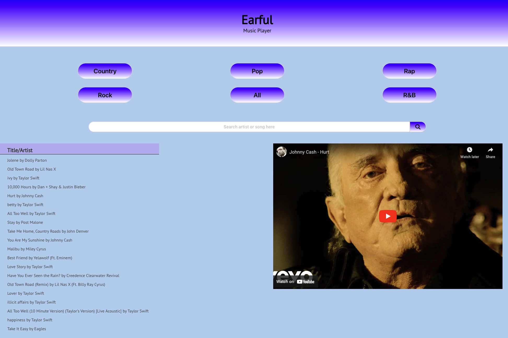
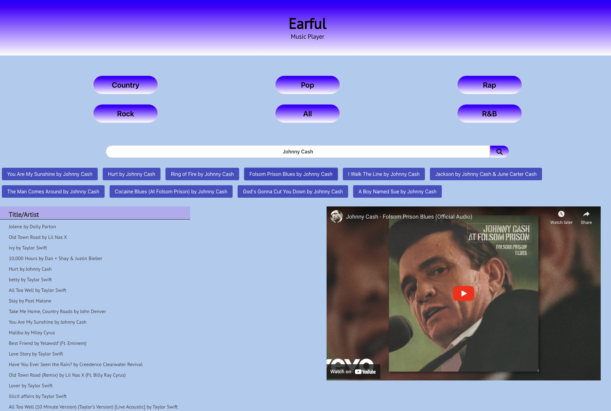

# Earful

## Decription
Earful is a playlist generation application. It functions by creating a randomized list of songs from a selection of genres or from a keyword search and displays the created playlist for the user.

## Installation
N/A

## Usage
A quick link to the deployment can be found here: https://chase-garrett.github.io/earful/

**The API keys associated with this project have been deactivated, in order to experience the full functionality of this frontend project you will need to attach your own API keys**

In order to utilize Earful, a user needs to click on one of the genre buttons or enter an example song or artist into the search bar and selecting the search button or pressing "enter" on the keyboard. The application will then generate a randomized playlist that will be displayed on the screen. After the playlist has been generated it will be kept in local storage until a new playlist is created. If the user searches for a song with the search bar, the playlist will instead be displayed as a series of 10 buttons just below the search bar. Similar to the playlist generated by the genre buttons if these buttons are clicked then a YouTube video featuring the song will be loaded. Users are able to click on songs listed in the playlist to view an embedded YouTube video featuring the song from the playlist. 

**NOTE: Only the songs generated by the genre buttons will be stored, the songs generated by the custom search will not persist through a refresh of the application.**

Example of the genre search:

Example of the custom search:

## Credits

In order to generate playlists the Genius API is utilized: https://docs.genius.com/

### **Contributors**

## LICENSE
Please refer to the LICENSE in the repo.
